# Ames Housing Dataset Analysis

## Problem Statement

The Ames Housing dataset offers valuable insights into the residential real estate market in Ames, Iowa, from 2006 to 2010. Analyzing this data is crucial as it encompasses various factors that influence home prices, helping stakeholders navigate market fluctuations. This analysis aims to identify key predictors of property values—such as living area, neighborhood quality, and remodeling efforts—to provide actionable insights for homebuyers, real estate investors, and agents. Ultimately, the goal is to enhance decision-making in the real estate sector, benefiting both individuals and the broader community.

## Data Dictionary

|       Variable Name        |     Type      | Description                                                                                         |
|----------------------------|---------------|-----------------------------------------------------------------------------------------------------|
| Order                      | Discrete      | Observation number.                                                                                 |
| PID                        | Nominal       | Parcel identification number, used for property review.                                             |
| MS SubClass                | Nominal       | Type of dwelling involved in the sale (e.g., 1-STORY, 2-STORY).                                     |
| MS Zoning                  | Nominal       | General zoning classification of the sale (e.g., Residential, Commercial).                          |
| Lot Frontage               | Continuous    | Linear feet of street connected to the property.                                                    |
| Lot Area                   | Continuous    | Lot size in square feet.                                                                            |
| Street                     | Nominal       | Type of road access to the property (e.g., Gravel, Paved).                                          |
| Alley                      | Nominal       | Type of alley access (e.g., Gravel, Paved, No access).                                              |
| Lot Shape                  | Ordinal       | General shape of the property (e.g., Regular, Irregular).                                           |
| Land Contour               | Nominal       | Flatness of the property (e.g., Near Flat, Banked).                                                 |
| Utilities                  | Ordinal       | Type of utilities available (e.g., All public, No Sewage).                                          |
| Lot Config                 | Nominal       | Lot configuration (e.g., Inside, Corner, Cul-de-sac).                                               |
| Land Slope                 | Ordinal       | Slope of property (e.g., Gentle, Moderate, Severe).                                                 |
| Neighborhood               | Nominal       | Physical location within Ames city limits (e.g., College Creek, Old Town).                          |
| Condition 1                | Nominal       | Proximity to various conditions (e.g., Adjacent to arterial street, Normal).                        |
| Condition 2                | Nominal       | Additional proximity conditions (if more than one is present).                                      |
| Bldg Type                  | Nominal       | Type of dwelling (e.g., Single-family Detached, Duplex).                                            |
| House Style                | Nominal       | Style of dwelling (e.g., 1 Story, 2 Story).                                                         |
| Overall Qual               | Ordinal       | Rating of overall material and finish of the house (1-10 scale).                                    |
| Overall Cond               | Ordinal       | Rating of overall condition of the house (1-10 scale).                                              |
| Year Built                 | Discrete      | Original construction date.                                                                         |
| Year Remod/Add             | Discrete      | Remodel date (same as construction date if no remodeling).                                          |
| Roof Style                 | Nominal       | Type of roof (e.g., Gable, Hip).                                                                    |
| Roof Matl                  | Nominal       | Roof material (e.g., Metal, Tile).                                                                  |
| Exterior 1                 | Nominal       | Exterior covering on the house (e.g., Brick Face, Vinyl Siding).                                    |
| Exterior 2                 | Nominal       | Secondary exterior covering (if applicable).                                                        |
| Mas Vnr Type               | Nominal       | Masonry veneer type (e.g., None, Brick Face).                                                       |
| Mas Vnr Area               | Continuous    | Masonry veneer area in square feet.                                                                 |
| Exter Qual                 | Ordinal       | Quality of exterior material (e.g., Excellent, Good).                                               |
| Exter Cond                 | Ordinal       | Condition of exterior material (e.g., Excellent, Poor).                                             |
| Foundation                 | Nominal       | Type of foundation (e.g., Poured Concrete, Wood).                                                   |
| Bsmt Qual                  | Ordinal       | Height of the basement (e.g., Excellent, Poor).                                                     |
| Bsmt Cond                  | Ordinal       | General condition of the basement (e.g., Excellent, Fair).                                          |
| Bsmt Exposure              | Ordinal       | Walkout or garden level wall exposure (e.g., Good, No Exposure).                                    |
| BsmtFin Type 1             | Ordinal       | Rating of basement finished area (e.g., Good Living Quarters).                                      |
| BsmtFin SF 1               | Continuous    | Type 1 finished square feet.                                                                        |
| BsmtFin Type 2             | Ordinal       | Rating of additional finished basement area (if applicable).                                        |
| BsmtFin SF 2               | Continuous    | Type 2 finished square feet.                                                                        |
| Bsmt Unf SF                | Continuous    | Unfinished square feet of basement area.                                                            |
| Total Bsmt SF              | Continuous    | Total square feet of basement area.                                                                 |
| Heating                    | Nominal       | Type of heating (e.g., Gas A, Electric).                                                            |
| HeatingQC                  | Ordinal       | Quality and condition of heating (e.g., Excellent, Poor).                                           |
| Central Air                | Nominal       | Central air conditioning (Yes/No).                                                                  |
| Electrical                 | Ordinal       | Type of electrical system (e.g., Standard, Fuse Box).                                               |
| 1st Flr SF                 | Continuous    | First floor square feet.                                                                            |
| 2nd Flr SF                 | Continuous    | Second floor square feet.                                                                           |
| Low Qual Fin SF            | Continuous    | Low quality finished square feet (all floors).                                                      |
| Gr Liv Area                | Continuous    | Above grade living area square feet.                                                                |
| Bsmt Full Bath             | Discrete      | Number of full bathrooms in the basement.                                                           |
| Bsmt Half Bath             | Discrete      | Number of half bathrooms in the basement.                                                           |
| Full Bath                  | Discrete      | Full bathrooms above grade.                                                                         |
| Half Bath                  | Discrete      | Half baths above grade.                                                                             |
| Bedroom                    | Discrete      | Bedrooms above grade (does not include basement bedrooms).                                          |
| Kitchen                    | Discrete      | Kitchens above grade.                                                                               |
| KitchenQual                | Ordinal       | Kitchen quality (e.g., Excellent, Fair).                                                            |
| TotRmsAbvGrd               | Discrete      | Total rooms above grade (excluding bathrooms).                                                      |
| Functional                 | Ordinal       | Home functionality (e.g., Typical, Minor Deductions).                                               |
| Fireplaces                 | Discrete      | Number of fireplaces.                                                                               |
| FireplaceQu                | Ordinal       | Quality of fireplace (e.g., Excellent, Poor).                                                       |
| Garage Type                | Nominal       | Garage location (e.g., Attached, Detached).                                                         |
| Garage Yr Blt              | Discrete      | Year garage was built.                                                                              |
| Garage Finish              | Ordinal       | Interior finish of the garage (e.g., Finished, Unfinished).                                         |
| Garage Cars                | Discrete      | Size of garage in car capacity.                                                                     |
| Garage Area                | Continuous    | Size of garage in square feet.                                                                      |
| Garage Qual                | Ordinal       | Garage quality (e.g., Excellent, Poor).                                                             |
| Garage Cond                | Ordinal       | Garage condition (e.g., Excellent, Poor).                                                           |
| Paved Drive                | Ordinal       | Paved driveway status (e.g., Paved, Dirt).                                                          |
| Wood Deck SF               | Continuous    | Wood deck area in square feet.                                                                      |
| Open Porch SF              | Continuous    | Open porch area in square feet.                                                                     |
| Enclosed Porch             | Continuous    | Enclosed porch area in square feet.                                                                 |
| 3-Ssn Porch                | Continuous    | Three season porch area in square feet.                                                             |
| Screen Porch               | Continuous    | Screen porch area in square feet.                                                                   |
| Pool Area                  | Continuous    | Pool area in square feet.                                                                           |
| Pool QC                    | Ordinal       | Pool quality (e.g., Excellent, Poor).                                                               |
| Fence                      | Ordinal       | Fence quality (e.g., Good Privacy, No Fence).                                                       |
| Misc Feature               | Nominal       | Miscellaneous feature not covered in other categories (e.g., Elevator, Tennis Court).               |
| Misc Val                   | Continuous    | $Value of miscellaneous feature.                                                                    |
| Mo Sold                    | Discrete      | Month sold (MM).                                                                                    |
| Yr Sold                    | Discrete      | Year sold (YYYY).                                                                                   |
| Sale Type                  | Nominal       | Type of sale (e.g., Normal Sale, Foreclosure).                                                      |
| Sale Condition             | Nominal       | Condition of sale (e.g., Normal, Abnormal).                                                         |
| SalePrice                  | Continuous    | Sale price in dollars.                                                                              |

This data dictionary summarizes each variable in the Ames Housing dataset, providing clarity on the type and meaning of each variable for better understanding and analysis. A more in depth dictionary can be found here: https://jse.amstat.org/v19n3/decock/DataDocumentation.txt.

## Executive Summary

### Data Cleaning Steps

The data cleaning process involved several steps to address missing values and outliers in the dataset. For Lot Frontage, which had 330 missing values, we replaced NaN with the mean value of 69.1 and removed four outliers exceeding 190. In the case of Mas Vnr Area, 22 missing values were addressed by filling NaN with the mean (99.7) and removing one outlier over 1400. BsmtFin SF 1, BsmtFin SF 2, and Bsmt Unf SF each had one missing value, which we replaced with 0 to indicate the absence of a basement, while also removing respective outliers (greater than 3500 for BsmtFin SF 1 and greater than 1200 for BsmtFin SF 2). The Total Bsmt SF had one missing value replaced with 0, and both Bsmt Full Bath and Bsmt Half Bath had two missing values each, which were also replaced with 0. 

For the garage-related fields, both Garage Cars and Garage Area had one missing value each, filled with 0, indicating no garage present. In the test set, Lot Frontage had 160 missing values that were filled with the training set's mean of 69.1, while Mas Vnr Area had one missing value replaced with 0 due to a NaN in the Mas Vnr Type. Finally, for the Electrical field, one missing value was filled with the mode ("SBrkr"). These thorough cleaning steps ensured that the dataset was robust for analysis, with missing values properly addressed and outliers effectively managed.

### Key Visualizations

#### Visualization 1: [Ground Living Area vs Sale Price]
[The scatterplot displays that as above ground living area increases, sale price also increases. Brick face masonry veneer type seems to be the most commonly used veneer type followed by stone which seems to be slightly associated with a higher sale price and then brick common being the least common veneer type.]

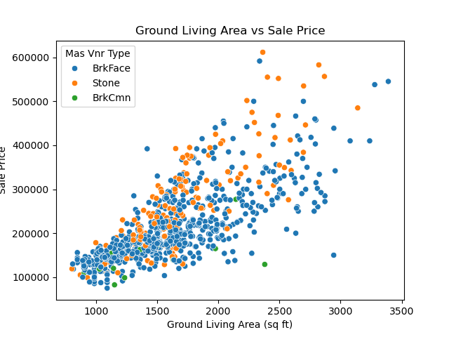

#### Visualization 2: [Distributions of Lot Area by Year]
[The side-by-side boxplots display the distributions of lot area by year. Overall, the average lot area has decreased over time potentially due to land scarcity or price.]

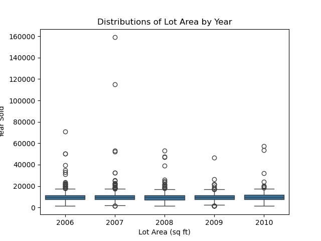

#### Visualization 3: [Distributions of Sale Price by Lot Configuration]
[The boxplots display the distributions of sale price by lot configuration. Overall, the average sale price for a home in a cul-de-sac is the most expensive followed by a lot with frontage on 3 sides of the property. An inside lot, a corner lot, and a lot with frontage on 2 sides of the property seem to have close averages and lower sale prices.]

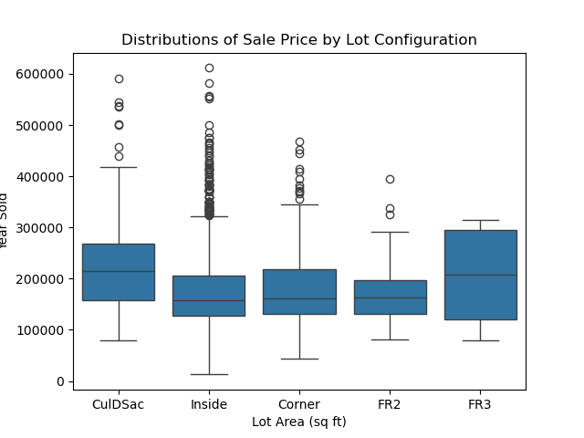

#### Visualization 4: [Distribution of Homes by Neighborhood]
[The countplot shows the distribution of homes by neighborhood; North Ames is the neighborhood with the highest number of homes followed by College Creek and Old Town. Single-family detached properties are the most popular kind of building across the board in most neighborhoods. The neighborhoods with the least amount of buildings are Green Hill, Greens, and Landmark only containing townhouses.]

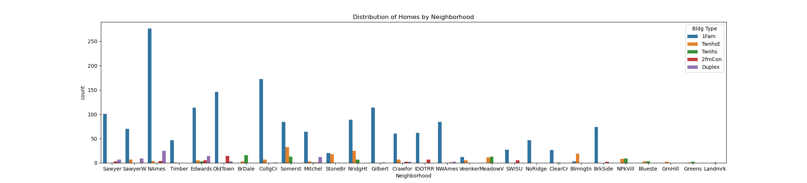

#### Visualization 5: [Distributions of Overall Quality by Total Number of Years]
[The side-by-side boxplots display the distributions of overall quality (the overall material and finish of the house) by the total number of years the houses had been built since. The average overall quality has increased as time has gone on with a slight exception with houses built 100 plus years ago.]

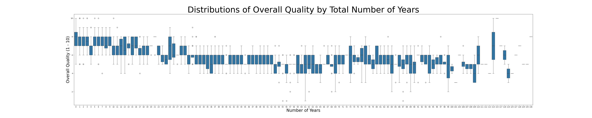

#### Visualization 6: [Distributions of Sale Price by Building Type]
[The side-by-side boxplots display the distributions of sale prices by building type. Townhouses have the highest average following single family homes.]

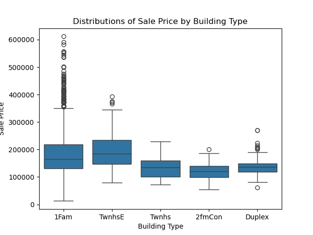

#### Visualization 7: [Distribution of Building Types by Masonry Veneer Type]
[The countplot displays the distributions of building types by masonry veneer type; single family homes show the highest count made up of brick face. Common bricks are always used for an internal and structural purpose, whereas face bricks are used for aesthetics. There is one key similarity between a face brick vs a common brick. Both are manufactured to be fire-resistant, weatherproof and energy-efficient.]

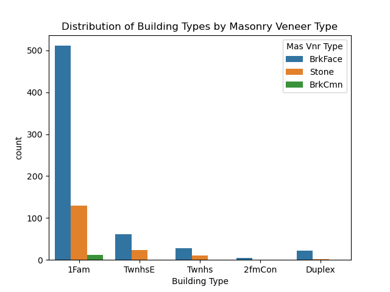

#### Visualization 8: [Distribution of House Styles]
[The countplot shown above displays the distribution of house styles with one story houses being the highest count. One story houses are also extremely common in the Midwest which may also lead to their popularity here in Ames, Iowa.]

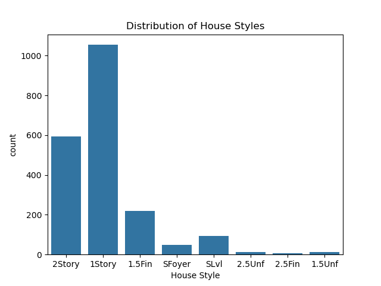

#### Visualization 9: [Distributions of Sale Price by the Year of Remodel/Addition]
[The side-by-side boxplots display the distributions of sale prices by year of remodel or addition. Average sale prices increase as time goes on if the home has been remodeled or has had an addition.]

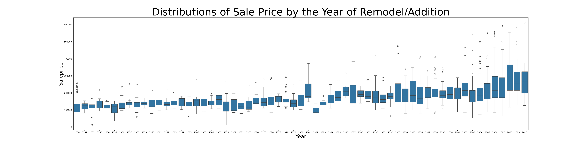

#### Visualization 10: [Distribution of Basement Quality Height by Foundation]
[The counplot displays the distribution basement quality height by foundation type. Good (90 - 99 inches) basements and typical (80 - 89 inches) basements have the highest count.]

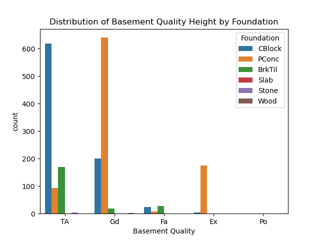

#### Visualization 11: [Distribution of Months Sold]
[The above histogram shows the distribution of properties sold throughout the year by month. The data is normally distributed with June having the highest count. Factors contributing to a more active real estate market with greater inventory and potential buyers is something to consider.]

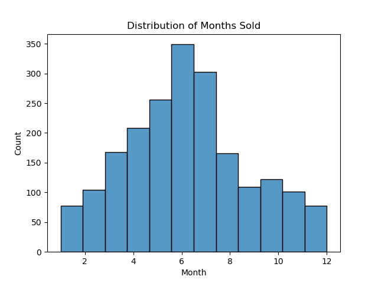

## Model Performance

### Model Selection

For the analysis, both Linear Regression and Random Forest models were employed. Key features included in the model were Overall Qual, Lot Frontage, Neighborhood, Gr Liv Area, Total Years, Mas Vnr Area, and Garage Area. Linear Regression was chosen for its interpretability and effectiveness in capturing linear relationships between features and the target variable. Random Forest was selected for its capability to handle non-linear relationships and interactions among features, making it robust against overfitting. This combination allowed for a comprehensive approach to prediction. Model performance significantly improved, with RMSE reducing from 81,388.08 (baseline) to 35,224.36 after feature selection.

### Evaluation Metrics
The performance of the models was evaluated using key metrics such as RMSE and R². The RMSE improved significantly from 81,388.08 at the baseline to 35,224.36 after feature selection, indicating a better fit to the data. Additionally, R² values demonstrated a strong explanatory power for the models, reflecting their ability to account for variability in the target variable. Overall, these metrics highlighted the effectiveness of the modeling approach in accurately predicting outcomes.

| Model             | RMSE           | R²                    |
|-------------------|----------------|-----------------------|
| Model 1           | [81388.07905]  | [N/A]                 |
| Model 2           | [48840.92170]  | [0.6530718754262215]  |
| Model 3           | [46130.41729]  | [0.7079099899589212]  |
| Model 4           | [45476.24575]  | [0.7320403554996169]  |
| Model 5           | [37779.74531]  | [0.7995836738352613]  |
| Model 6           | [37894.94479]  | [0.8023796179239584]  |
| Model 7           | [36161.38999]  | [0.8177393028596032]  |
| Model 8           | [36161.38999]  | [0.8179044963887809]  |
| Model 9           | [36161.38999]  | [0.8175870428720466]  |
| Model 10          | [35561.66790]  | [0.8255178870687105]  |
| Model 11          | [35224.36938]  | [0.8316864566282344]  |

### Kaggle Submissions

As of 10/15/2024, I hold the only position on the Kaggle Leaderboard.

## Conclusions/Recommendations

The analysis of the Ames Housing dataset revealed several key findings. Firstly, a strong positive correlation was found between the above-ground living area and sale price, indicating that larger living spaces typically command higher prices, as buyers prioritize square footage. Additionally, significant variations in property values were noted across different neighborhoods, with North Ames having the highest concentration of homes, underscoring the importance of location in market desirability. 

The study also highlighted that homes built more recently tend to have better overall quality and condition ratings, reflecting rising buyer expectations for modern amenities. Properties that had undergone remodeling or additions generally fetched higher sale prices, with a clear upward trend in prices linked to the year of remodeling. 

Furthermore, the analysis observed a decrease in average lot area over the years, potentially due to land scarcity and increasing housing demand, indicating shifting dynamics in land use. Seasonal sales patterns were evident, with June emerging as the peak month for property sales, influenced by factors such as weather and school schedules. Lastly, brick face masonry was identified as the most common veneer type, showing a slight association with higher sale prices, suggesting that aesthetic choices can impact buyer perceptions of value. 

These insights provide valuable information for real estate stakeholders, aiding in pricing strategies, investment decisions, and market forecasting.